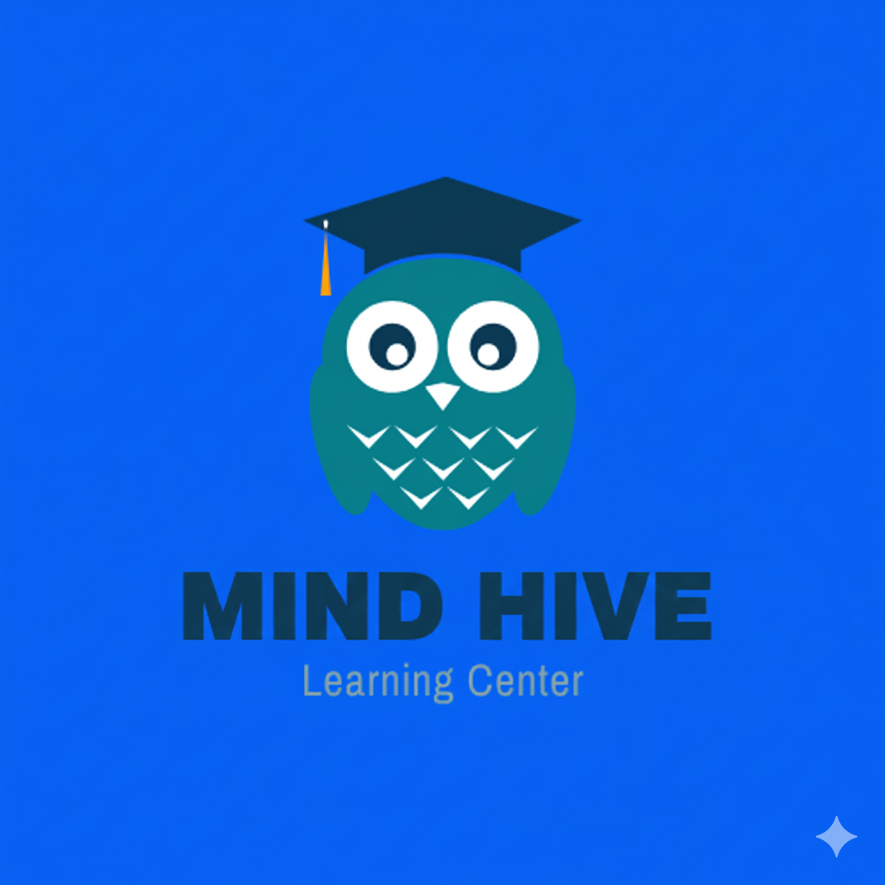

## 🦉 MindHive: Online Learning App

  

MindHive is a smart Kotlin-based mobile application designed to help you enhance mindfulness, improve focus, and boost productivity. By combining guided meditation, task management, and MindHive empowers users to cultivate better habits, reduce stress, and maximize efficiency in daily life.  

Track your tasks, practice mindfulness, and receive personalized insights that help you stay balanced and productive. MindHive is more than an app it’s your personal companion for mental clarity and growth.  

---

## 🚀 Features

### Mindfulness & Meditation
- Guided meditation sessions for stress relief and focus improvement.  
- Mindfulness exercises for mental clarity.  
- Track meditation streaks and progress over time.  

### Task & Productivity Management
- Add, edit, and delete tasks with deadlines and priorities.  
- Organize tasks by categories (Work, Study, Personal, Health).  
- Receive reminders and notifications to stay on track.  

### AI-Powered Insights
- Analyze productivity patterns and mindfulness habits.  
- Personalized tips to improve focus and time management.  
- Visual charts to track mood and task completion trends.  

### Data Persistence
- Secure storage of tasks and meditation history using SharedPreferences.  
- Optional data backup and restore via Internal Storage or cloud sync.  

### Push Notifications
- Reminders for meditation sessions and task deadlines.  
- Motivational notifications to encourage daily mindfulness practices.  

---

## 🛠️ Tech Stack
- IDE: Android Studio  
- Programming Language: Kotlin  
- Data Storage: SharedPreferences + Internal Storage  
- UI Design: XML / Jetpack Components  
- Notifications: Android Notification Manager  

---

## 📋 Methodology
- Conducted user research to identify productivity and mindfulness needs.  
- Studied existing meditation and productivity apps for best practices.  
- Iterative design and testing to ensure smooth, intuitive user experience.  

---

## 🎨 Design Method
- UI/UX prototyped using Figma.  
- Icons and visual elements designed with Photoshop.  
- Developed interactive prototypes to guide the implementation.  

---

## 📌 Roadmap / Future Enhancements
- AI-generated personalized meditation sessions.  
- Integration with wearable devices for stress & focus monitoring.  
- Dark mode and theme customization.  
- Cloud sync for cross-device task and meditation tracking.  

---

## 👩🏻‍💻 Author
Developed by **[Aisha_Nafy](https://www.linkedin.com/in/aisha-nafy/)**  
Undergraduate Information Technology Student | SLIIT  
